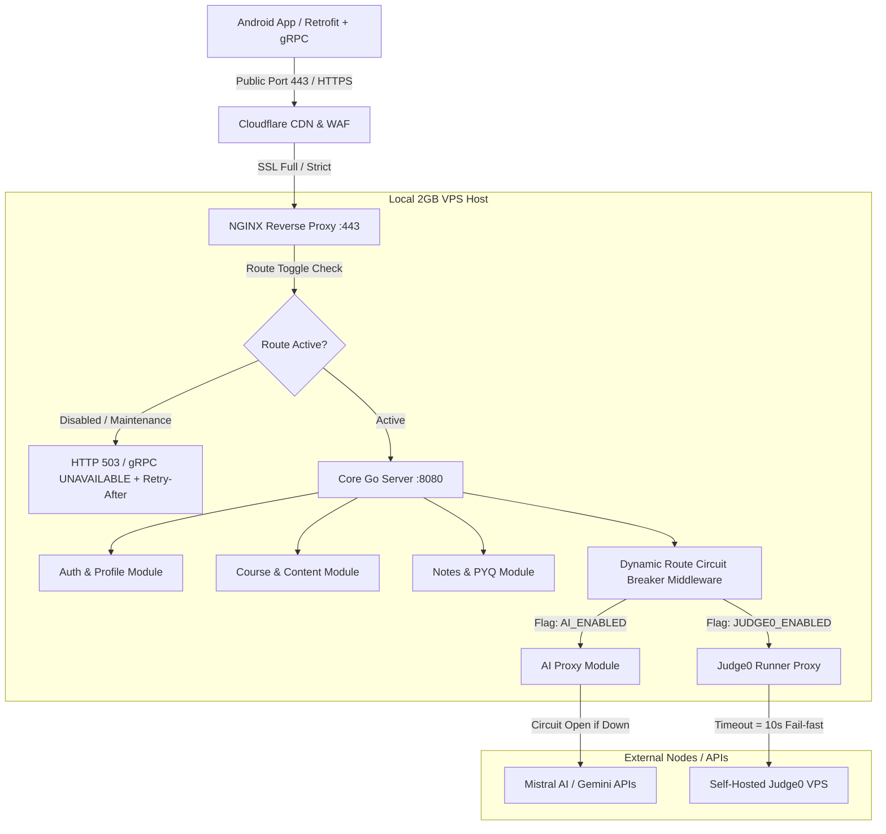

# Vastavik Learning Platform — Master Backend Architecture & Implementation Blueprint
**Target Infrastructure:** 2 vCPU, 2 GB RAM Linux VPS (Ubuntu 22.04/24.04 LTS)  
**Budget / Cost:** $0.00 / month (Free Open-Source Stack + Cloudflare Free + Firebase Spark Free)  
**Protocols:** REST (HTTP/1.1 & HTTP/2 JSON) + gRPC (HTTP/2 Protobuf + Bidirectional Streaming)  
**Primary Database:** Firebase Firestore  
**Target Generator:** Gemini 3.8 Flash  

---

## 1. Executive Summary & Hardware Budget (2GB RAM / 2 vCPU)

Running a high-concurrency educational platform with Live Classrooms, AI Chat, Code Execution, and Course Delivery on a **2 GB RAM / 2 vCPU** machine requires extreme memory efficiency and zero-bloat architecture:

| Component | Technology Recommended | Memory Footprint | Role |
| :--- | :--- | :--- | :--- |
| **Edge Proxy & WAF** | NGINX (or Caddy) | ~15 MB | SSL Termination, L7 Rate Limiting, Route Circuit Breaking |
| **Core Backend Daemon** | **Go (Golang 1.22+)** compiled binary | **~30 - 45 MB** | Unified gRPC + REST Gateway, HMAC auth, Firestore driver |
| **Realtime Daemon** | Go Goroutines / Socket.IO Hub | ~20 MB | WebRTC signaling bus, Peer Chat WebSocket server |
| **In-Memory Cache / Rate Limit** | In-Process RWMutex LRU (or Redis Lean) | ~20 MB | Token-bucket rate limiter, route maintenance toggles |
| **OS + Kernel Buffers** | Ubuntu 22.04 LTS Minimal | ~250 MB | Linux base processes, network stack, UFW, Fail2ban |
| **Total Steady State Memory** | | **~360 MB / 2048 MB** | **Leaves >1.6 GB RAM headroom for burst traffic!** |

> **Why Go instead of Node/Python?**  
> A Python (FastAPI) or Node.js multi-process setup consumes 300–600 MB at idle and suffers from GIL/V8 garbage collection spikes. A single statically linked Go binary handles 10,000+ concurrent persistent connections with goroutines consuming only 2 KB of memory each.

---

## 2. Exhaustive App Audit: Working vs. Mock vs. Broken vs. Missing

The Android app codebase (`vastavikLearning-app`) currently consists of **34 distinct screen routes** and supporting managers. Here is the exact status of every feature and the backend contract required to make it 100% production-ready:

| Screen / Feature | Route / Class | Current Client State | Security & Architectural Gap | Required Backend Contract |
| :--- | :--- | :--- | :--- | :--- |
| **Splash & Integrity** | `SplashScreen`, `SecurityCheckScreen` | Root, emulator, hook detection runs locally via `DeviceSecurityChecker`. | Client-only check; compromised devices can patch bytecode. | `POST /api/v1/auth/device-verify`: Validates device integrity attestation. |
| **Authentication** | `LoginScreen`, `SignupScreen`, `ForgotPasswordScreen` | Directly calls Firebase Auth Android SDK. | No server rate-limiting on brute force; no audit log. | `POST /api/v1/auth/login`, `POST /api/v1/auth/signup`, `POST /api/v1/auth/oauth/{provider}`. |
| **Home Screen** | `HomeScreen`, `HomeViewModel` | Reads `courses`, `banners`, `popularTopics` directly from Firestore SDK. | High client read count directly drains free Firebase quota. | `GET /api/v1/catalog/home`: Cached JSON bundle (courses, banners, topics). |
| **Course & Learning Path** | `LearningPathScreen`, `LearningViewModel` | Reads `parts`, `subparts`, `studentSelections` via Firestore listeners. | Progress update writes directly to Firestore with unverified client rules. | `GET /api/v1/courses/{id}/curriculum`, `POST /api/v1/progress/visited`. |
| **Video Lessons** | `VideoLessonScreen`, `VideoLessonViewModel` | Defined `VastavikApiService` (`api/lessons/{id}`), but server was absent; falls back to Firestore. | YouTube URL exposure; unverified premium content checks. | `GET /api/v1/lessons/{id}`: Enforces premium entitlement, returns signed video metadata. |
| **Vastavik AI Chat** | `ChatScreen`, `VastavikAi.kt` | Calls Mistral (`api.mistral.ai`) and Gemini directly from phone. | **CRITICAL SECURITY FLAW:** API keys stored in client `BuildConfig`! | `POST /api/v1/ai/chat` (REST) & `rpc StreamChat` (gRPC streaming): Hides keys on server, proxies requests. |
| **Peer Chat** | `PeerChatScreen`, `StudentConversationManager` | Tries WebSocket to `BASE_URL/socket.io/`, falls back to Firestore polling. | WebSocket server missing on backend; Firestore polling has high latency. | WebSocket / Socket.IO endpoint `/socket.io/` or gRPC `rpc JoinPeerChat`. |
| **Code Editor & Judge** | `CodeEditorScreen`, `Judge0Service` | Direct client HTTP call to `http://139.84.172.230:2358/submissions`. | **CRITICAL SECURITY FLAW:** Direct unencrypted HTTP to raw IP with auth token! | `POST /api/v1/code/execute`: Backend proxies Judge0 with rate-limiting & timeout. |
| **OCR Code Scanner** | `OcrExerciseScreen` | On-device ML Kit text recognition. | Working on device; syntax error correction is absent. | Optional `POST /api/v1/code/clean-ocr`: Formats and fixes OCR code glitches. |
| **Live Classroom** | `LobbyScreen`, `InClassScreen`, `WebRtcMeetingClient` | Uses Firestore collections (`live_classes/...`) as WebRTC signaling bus. | Firestore document writes are too slow for low-latency ICE candidate exchange. | gRPC `rpc LiveClassSignaling` stream: Ultra-low latency WebRTC SDP/ICE relay. |
| **Doubt Engine** | `DoubtSolvingScreen` | 3-step UI. Step 3 simulates payment via mock toast message. | Missing media upload endpoint, ticket queue, and payment capture. | `POST /api/v1/doubts/submit`: Accepts multipart image/video, creates Firestore ticket. |
| **Payments & Pro** | `PaymentScreen`, `PaymentHistoryScreen` | Launches raw UPI URL `upi://pay?pa=...`; `PaymentHistoryScreen` has hardcoded mock data. | **COMPLETELY BROKEN:** No order creation, no webhook verification, fake history list. | `POST /api/v1/payments/create-order`, `POST /api/v1/payments/webhook`, `GET /api/v1/payments/history`. |
| **My Notes** | `MyNotesScreen` | Hardcoded mock data `listOf(Pair("OOP Notes", ...))`. | Notes not saved to database. | `GET /api/v1/notes`, `POST /api/v1/notes`, `DELETE /api/v1/notes/{id}`. |
| **Past Year Questions** | `PYQScreen` | Hardcoded mock data `Triple("ICSE 2023", ...)`. | Database not queried despite `PYQModel` existing. | `GET /api/v1/pyqs?board={board}&year={year}`. |
| **Global Search** | `SearchResultsScreen` | Hardcoded mock results in memory. | No full-text search capability. | `GET /api/v1/search?q={query}`. |
| **Bug Reports** | `BugReportScreen` | Simulates submit with `delay(1200); VBUG-XXXXX`. | Reports and media are never saved anywhere. | `POST /api/v1/system/bug-report` (multipart with screenshot + log attachments). |
| **Notifications** | `NotificationsScreen` | Hardcoded mock notification list. | FCM push delivery and notification history not stored. | `GET /api/v1/notifications`, `POST /api/v1/notifications/token`. |
| **App Update Engine** | `AppUpdateScreen`, `AppUpdater` | Queries GitHub Releases API directly from client. | GitHub API rate limit (60 req/hr per IP) triggers HTTP 403 on shared campus Wi-Fi. | `GET /api/v1/system/app-update`: Backend caches GitHub latest release info. |
| **Admin Dashboard** | `AdminDashboardScreen`, `AdminSession` | Hardcoded credentials `admin@admin.admin / admin@admin`. | **CRITICAL SECURITY FLAW:** Hardcoded client-side admin login. | `POST /api/v1/admin/login`: Verifies admin role in Firestore, returns Admin JWT with claims. |

---

## 3. High Availability & Fault Isolation: Route Circuit Breaker Architecture

### The Problem
You need to be able to fix or take down a single failing route (e.g. AI engine timeout, payment gateway migration, or a broken code runner on an external VPS) **WITHOUT turning off the main server**, and if an external VPS hosting that route is shut down, the rest of the application must continue running normally.

### The Solution: Two-Tier Circuit Breaker



### 1. Dynamic Route Maintenance Middleware (Inside Core Go Server)
Routes can be enabled/disabled at runtime **without restarting the binary** via an in-memory thread-safe map, toggled through an authenticated admin API or a watched config file:

```go
// RouteStatusManager controls independent feature availability
type RouteStatusManager struct {
    sync.RWMutex
    routes map[string]bool // e.g., "ai_chat": true, "code_exec": false
}

func (m *RouteStatusManager) IsEnabled(feature string) bool {
    m.RLock()
    defer m.RUnlock()
    enabled, exists := m.routes[feature]
    return !exists || enabled // Default open unless explicitly set false
}

// CircuitBreakerMiddleware checks if the route is enabled
func CircuitBreakerMiddleware(feature string, mgr *RouteStatusManager) gin.HandlerFunc {
    return func(c *gin.Context) {
        if !mgr.IsEnabled(feature) {
            c.Header("Retry-After", "300")
            c.JSON(http.StatusServiceUnavailable, gin.H{
                "status": "MAINTENANCE",
                "error": "ROUTE_TEMPORARILY_OFFLINE",
                "message": "This specific feature is undergoing scheduled maintenance. All other app services remain fully operational.",
                "feature": feature,
            })
            c.Abort()
            return
        }
        c.Next()
    }
}
```

### 2. NGINX Upstream Fail-Fast Configuration (Handles External VPS Shutdown)
If Judge0 or an external microservice runs on a separate VPS and you shut that VPS down, NGINX instantly catches the failure within 1 second and serves a graceful maintenance payload instead of hanging connections:

```nginx
# /etc/nginx/sites-available/vastavik
upstream judge0_backend {
    server 139.84.172.230:2358 max_fails=2 fail_timeout=10s;
    # Fallback backup server on localhost if external VPS is off
    server 127.0.0.1:8081 backup;
}

server {
    server_name api.vastaviklearning.com;
    listen 443 ssl http2;

    # Core App (Always Running)
    location /api/v1/ {
        proxy_pass http://127.0.0.1:8080;
        proxy_http_version 1.1;
        proxy_set_header Connection "";
        proxy_set_header Host $host;
        proxy_set_header X-Real-IP $remote_addr;
        proxy_set_header X-Forwarded-For $proxy_add_x_forwarded_for;
        proxy_connect_timeout 3s;
        proxy_read_timeout 30s;
    }

    # Isolated Code Execution Proxy
    location /api/v1/code/ {
        proxy_pass http://judge0_backend;
        proxy_connect_timeout 1s; # Fail fast if VPS is powered down!
        proxy_read_timeout 15s;
        proxy_next_upstream error timeout http_502 http_503;
        error_page 502 503 504 = @route_offline;
    }

    # Real-Time WebSocket for Peer Chat
    location /socket.io/ {
        proxy_pass http://127.0.0.1:8080;
        proxy_http_version 1.1;
        proxy_set_header Upgrade $http_upgrade;
        proxy_set_header Connection "Upgrade";
        proxy_read_timeout 86400s;
    }

    # gRPC Endpoint
    location /vastavik.VastavikService/ {
        grpc_pass grpc://127.0.0.1:9090;
        grpc_connect_timeout 2s;
        grpc_read_timeout 60s;
        error_page 502 503 = @grpc_offline;
    }

    location @route_offline {
        default_type application/json;
        return 503 '{"status":"OFFLINE","error":"SERVICE_MAINTENANCE","message":"Code execution engine is temporarily offline for maintenance. Other app features work normally."}';
    }

    location @grpc_offline {
        # gRPC UNAVAILABLE status code (14)
        add_header grpc-status 14;
        add_header grpc-message "Service route temporarily unavailable";
        return 204;
    }
}
```

---

## 4. High Authentication, Security & Password Hashing

### 1. SHA-256 Password Storage
Per user requirement:
- When a user signs up with email & password, the backend calculates:
  $$\text{passwordHash} = \text{SHA256}(\text{password} + \text{userSalt})$$
- The unique `salt` (32 cryptographically secure random bytes in hex) and the resulting 64-character SHA-256 hex string are stored in the `users/{uid}` document in Firestore.
- During login:
  $$\text{computed} = \text{SHA256}(\text{inputPassword} + \text{userSalt})$$
  Verification succeeds if $\text{computed} == \text{storedHash}$ using constant-time string comparison (`subtle.ConstantTimeCompare`).

### 2. Dual-Layer HMAC + Bearer Verification
Matches the client-side `AuthInterceptor.kt`:
1. **Static API Headers:**
   - `x-api-key-id`: Verified against server environment secret.
   - `x-api-key-secret`: Checked against server configuration.
2. **HMAC-SHA256 Request Signature:**
   - Client sends `x-timestamp` and `x-hmac`.
   - Backend checks: $| \text{serverTime} - \text{clientTime} | < 300\text{ seconds}$ (prevents replay attacks).
   - Backend computes: $\text{expectedHmac} = \text{HMAC-SHA256}(\text{API\_SECRET}, \text{timestamp} + \text{method} + \text{path})$.
3. **Identity Token:**
   - If `Authorization: Bearer <token>` is passed, the backend verifies the token using the Firebase Admin SDK (`auth.VerifyIDToken(ctx, token)`) or internal JWT validator.

### 3. Google & GitHub OAuth Implementation
- **Google Sign-In:**
  - Client sends `idToken`.
  - Backend calls Google OAuth2 token verification API (`https://oauth2.googleapis.com/tokeninfo?id_token=...`).
  - Automatically provisions or links Firestore profile in `users/{uid}`.
- **GitHub Sign-In:**
  - Client initiates OAuth and passes authorization `code`.
  - Backend POSTs to `https://github.com/login/oauth/access_token` with `client_id` and `client_secret`.
  - Fetches user profile from `https://api.github.com/user`.
  - Links user to Firestore `users/{uid}` with `github_id` and issues session JWT.

---

## 5. Rate Limiting, DDoS Mitigation & VPS Firewall Setup

### 1. Rate Limiting Matrix
Implemented in Go using in-memory Token Bucket (Zero Redis dependency needed for 2GB RAM):

| Route Group | Limit Per IP | Limit Per User | Window | On Breach |
| :--- | :--- | :--- | :--- | :--- |
| **Auth / Login** | 5 requests | 5 requests | 1 minute | HTTP 429 + 15 min IP block if repeated |
| **AI Chat** | 10 requests | 10 requests | 1 minute | HTTP 429 ("AI quota cooling down") |
| **Code Execution (Judge0)** | 8 submissions | 6 submissions | 1 minute | HTTP 429 ("Execution queue full") |
| **Courses / Lessons / Content** | 120 requests | 120 requests | 1 minute | HTTP 429 |
| **Live WebRTC Signaling** | 600 packets | 600 packets | 1 minute | Silently drop duplicate ICE candidates |

### 2. Linux VPS Hardening & Firewall (Ubuntu 22.04)

Run these exact commands to lock down the VPS:

```bash
# 1. Update and install essential packages
sudo apt-get update && sudo apt-get install -y ufw fail2ban nginx git curl

# 2. Configure UFW (Deny all incoming except SSH, HTTP, HTTPS)
sudo ufw default deny incoming
sudo ufw default allow outgoing
sudo ufw allow 22/tcp    # SSH (change port if custom)
sudo ufw allow 80/tcp    # NGINX HTTP (Certbot)
sudo ufw allow 443/tcp   # NGINX HTTPS & gRPC
sudo ufw enable

# 3. Configure Fail2ban to block DDoS & brute-force attempts
sudo cat << 'EOF' > /etc/fail2ban/jail.local
[DEFAULT]
bantime = 1h
findtime = 10m
maxretry = 5

[sshd]
enabled = true
port = 22

[nginx-req-limit]
enabled = true
filter = nginx-req-limit
action = iptables-multiport[name=ReqLimit, port="http,https", protocol=tcp]
logpath = /var/log/nginx/error.log
findtime = 600
maxretry = 10
bantime = 7200
EOF

sudo systemctl restart fail2ban
```

### 3. Cloudflare Setup ($0 Free Tier)
1. Point your domain DNS to Cloudflare Nameservers.
2. Under **SSL/TLS**, set mode to **Full (Strict)**.
3. Under **Security > WAF > Rate Limiting Rules**, add a rule: If requests from single IP exceed 150/minute, challenge with Turnstile.
4. Under **Network**, enable **gRPC** and **WebSockets** toggles.

---

## 6. Dual Protocol Specification: gRPC & REST

### Complete Protocol Buffers Schema (`vastavik.proto`)

```protobuf
syntax = "proto3";

package vastavik;
option go_package = "github.com/vastavik/backend/proto/vastavik";

service VastavikService {
  // Authentication & User
  rpc Login (LoginRequest) returns (AuthResponse);
  rpc Register (RegisterRequest) returns (AuthResponse);
  rpc OAuthLogin (OAuthRequest) returns (AuthResponse);
  rpc GetUserProfile (UserProfileRequest) returns (UserProfileResponse);

  // Courses & Lessons
  rpc GetHomeCatalog (CatalogRequest) returns (HomeCatalogResponse);
  rpc GetLesson (LessonRequest) returns (LessonResponse);
  rpc MarkVisited (VisitedRequest) returns (CommonStatusResponse);

  // AI Streaming Chat
  rpc StreamChat (stream ChatMessageRequest) returns (stream ChatMessageResponse);

  // Online Judge Code Execution
  rpc ExecuteCode (ExecuteCodeRequest) returns (ExecuteCodeResponse);

  // Real-Time Classroom & WebRTC Signaling
  rpc MeetingSignaling (stream SignalPacket) returns (stream SignalPacket);

  // System & Health
  rpc HealthCheck (HealthRequest) returns (HealthResponse);
}

message LoginRequest {
  string email = 1;
  string password = 2;
  string device_fingerprint = 3;
}

message RegisterRequest {
  string email = 1;
  string password = 2;
  string name = 3;
  string board = 4;
  string preferred_language = 5;
}

message OAuthRequest {
  string provider = 1; // "google" or "github"
  string token_or_code = 2;
}

message AuthResponse {
  bool success = 1;
  string access_token = 2;
  string refresh_token = 3;
  string user_id = 4;
  string name = 5;
  string error_message = 6;
}

message UserProfileRequest {
  string user_id = 1;
}

message UserProfileResponse {
  string user_id = 1;
  string name = 2;
  string email = 3;
  string role = 4;
  bool is_premium = 5;
  int32 streak_count = 6;
  int32 lessons_completed = 7;
}

message CatalogRequest {}

message HomeCatalogResponse {
  repeated CourseItem courses = 1;
  repeated BannerItem banners = 2;
  repeated TopicItem popular_topics = 3;
}

message CourseItem {
  string id = 1;
  string title = 2;
  string description = 3;
  string icon_name = 4;
  int64 color = 5;
  int32 order = 6;
}

message BannerItem {
  string id = 1;
  string title = 2;
  string image_url = 3;
  string target_route = 4;
}

message TopicItem {
  string id = 1;
  string name = 2;
  string tag = 3;
}

message LessonRequest {
  string lesson_id = 1;
}

message LessonResponse {
  string id = 1;
  string title = 2;
  string description = 3;
  string youtube_url = 4;
  string youtube_video_id = 5;
  int32 duration_sec = 6;
  string whiteboard_image_url = 7;
  string code_sample = 8;
  string notes = 9;
  bool is_premium = 10;
}

message VisitedRequest {
  string user_id = 1;
  string course_id = 2;
  string part_id = 3;
}

message CommonStatusResponse {
  bool success = 1;
  string message = 2;
}

message ChatMessageRequest {
  string session_id = 1;
  string model_id = 2; // "mistral-god", "gemini-3.7-flash", "gemini-3.6-flash"
  string prompt = 3;
  repeated ChatHistoryItem history = 4;
}

message ChatHistoryItem {
  string role = 1; // "user" or "assistant"
  string text = 2;
}

message ChatMessageResponse {
  string delta_text = 1;
  bool is_finished = 2;
  string error_message = 3;
}

message ExecuteCodeRequest {
  string language = 1; // "java", "python", "cpp", "javascript"
  string source_code = 2;
  string stdin = 3;
}

message ExecuteCodeResponse {
  bool success = 1;
  string stdout = 2;
  string stderr = 3;
  string execution_time = 4;
  int32 memory_kb = 5;
  string status_description = 6;
}

message SignalPacket {
  string class_id = 1;
  string sender_id = 2;
  string target_id = 3;
  string signal_type = 4; // "OFFER", "ANSWER", "ICE", "WHITEBOARD"
  string payload_json = 5;
}

message HealthRequest {}

message HealthResponse {
  string status = 1;
  map<string, bool> route_status = 2;
  int64 uptime_seconds = 3;
}
```

---

## 7. Complete REST API Specification

All REST endpoints accept and return `application/json`.  
Headers expected: `x-api-key-id`, `x-api-key-secret`, `x-timestamp`, `x-hmac`, and optionally `Authorization: Bearer <token>`.

### 1. Auth & Profiles
- `POST /api/v1/auth/signup`
  - Body: `{"email":"student@test.com","password":"plainPassword","name":"Parth","board":"ICSE","language":"Java"}`
  - Logic: Generates salt, hashes via SHA-256, stores in Firestore `users/{uid}`, issues JWT.
- `POST /api/v1/auth/login`
  - Body: `{"email":"student@test.com","password":"plainPassword"}`
  - Logic: Reads user salt, verifies SHA-256 hash, returns access + refresh JWTs.
- `POST /api/v1/auth/oauth/google`
  - Body: `{"idToken":"eyJhbGciOiJSUzI1..."}`
  - Logic: Verifies with Google, links Firestore document, returns JWT.
- `POST /api/v1/auth/oauth/github`
  - Body: `{"code":"gh_code_123"}`
  - Logic: Exchanges code for token at GitHub, links user, returns JWT.
- `GET /api/v1/user/profile`
  - Headers: `Authorization: Bearer <token>`
  - Returns: Current `UserModel` data.

### 2. Courses & Curriculum
- `GET /api/v1/catalog/home`
  - Returns: `{ "courses": [...], "banners": [...], "popularTopics": [...] }` (Cached for 5 mins in RAM).
- `GET /api/v1/courses/{courseId}/curriculum`
  - Returns: All parts and subparts for the course.
- `GET /api/v1/lessons/{lessonId}`
  - Returns: `LessonModel` details. If `isPremium == true`, verifies user subscription in Firestore.
- `POST /api/v1/progress/visited`
  - Body: `{"courseId":"course_1","partId":"part_2"}`
  - Logic: Adds `"course_1::part_2"` to `studentSelections/{uid}.visitedParts`.

### 3. AI Proxy Engine (Streaming & Fallback)
- `POST /api/v1/ai/chat`
  - Body: `{"model":"mistral-god","prompt":"Explain recursion in Java","history":[]}`
  - Circuit Breaker Key: `"ai_chat"`
  - Logic: Calls Mistral Small; if 429/error, falls back to Gemini 3.7 Flash, then Gemini 3.6 Flash.
- `GET /api/v1/ai/chat/stream?prompt=...&model=...`
  - Server-Sent Events (SSE) streaming tokens word-by-word to the Android client.

### 4. Code Execution (Judge0 Wrapper)
- `POST /api/v1/code/execute`
  - Body: `{"language":"python","sourceCode":"print('Hello')","stdin":""}`
  - Circuit Breaker Key: `"code_execution"`
  - Timeout: 10 seconds.
  - Returns: `{"success":true,"output":"Hello\n","executionTime":"0.02s","memoryKb":1240,"statusDescription":"Accepted"}`

### 5. Payments & Subscriptions
- `POST /api/v1/payments/create-order`
  - Body: `{"planId":"monthly_pro","amount":149.0}`
  - Returns: PhonePe/Razorpay payment token and checksum.
- `POST /api/v1/payments/webhook`
  - Verifies gateway webhook signature.
  - Updates `transactions/{txId}` and sets `users/{uid}.isPremium = true` and `subscriptionExpiresAt`.
- `GET /api/v1/payments/history`
  - Returns: Array of user's transactions from Firestore.

### 6. Notes, PYQs, Search & Diagnostics
- `GET /api/v1/notes` & `POST /api/v1/notes` & `DELETE /api/v1/notes/{id}`: Full CRUD for student notes in `notes` collection.
- `GET /api/v1/pyqs?board={board}&year={year}`: Fetches matching past year questions from `pyq` collection.
- `GET /api/v1/search?q={query}`: Searches titles in courses, topics, and coding challenges.
- `POST /api/v1/system/bug-report`: Multipart upload handling title, description, device info, screenshots, and screen recording video.
- `GET /api/v1/system/app-update`: Returns cached latest APK download URL and changelog.

### 7. Dynamic Admin & Route Control
- `GET /admin/routes`: Returns list of all routes and their current status (`UP`, `MAINTENANCE`, `OFFLINE`).
- `POST /admin/routes/{feature}/toggle`: Toggles feature without restarting server. Requires `admin` JWT claim.

---

## 8. Firestore Database Collections & Schemas

```typescript
// users/{uid}
interface UserDocument {
  uid: string;
  name: string;
  email: string;
  passwordHash: string; // SHA-256(password + salt)
  salt: string;         // 32-byte random hex salt
  role: "student" | "admin";
  board: "ICSE" | "CBSE";
  preferredLanguage: "Java" | "Python";
  isPremium: boolean;
  subscriptionExpiresAt: string;
  streakCount: number;
  totalLessonsCompleted: number;
  createdAt: Timestamp;
}

// courses/{courseId}
interface CourseDocument {
  title: string;
  description: string;
  iconName: string;
  color: number;
  order: number;
  isPublished: boolean;
}

// courses/{courseId}/parts/{partId}
interface PartDocument {
  title: string;
  description: string;
  order: number;
}

// courses/{courseId}/parts/{partId}/subparts/{subpartId}/lessons/{lessonId}
interface LessonDocument {
  title: string;
  description: string;
  youtubeUrl: string;
  youtubeVideoId: string;
  durationSec: number;
  whiteboardImageUrl: string;
  codeSample: string;
  notes: string;
  isPremium: boolean;
  order: number;
}

// transactions/{txId}
interface TransactionDocument {
  uid: string;
  amount: number;
  currency: "INR";
  status: "pending" | "success" | "failed";
  planId: string;
  gatewayTransactionId: string;
  timestamp: Timestamp;
}

// bug_reports/{reportId}
interface BugReportDocument {
  ticketId: string; // "VBUG-12345"
  userId: string;
  title: string;
  description: string;
  category: string;
  deviceDiagnostics: string;
  mediaUrls: string[];
  createdAt: Timestamp;
}
```

---

## 9. Master Prompt to Provide Directly to Gemini 3.8 Flash

Copy and paste the following prompt directly into Gemini 3.8 Flash to generate the entire production codebase:

```markdown
You are an expert Principal Go Backend Architect. Generate a complete, production-ready, ultra-lightweight Go backend application tailored for a 2 vCPU / 2 GB RAM Ubuntu VPS.

The backend serves the "Vastavik Learning" Android application and must strictly follow these requirements:

1. ARCHITECTURE & RESOURCE BUDGET:
   - Language: Go 1.22+ using standard library + Gin (or Fiber) + Google gRPC.
   - Memory target: < 45 MB RAM steady-state.
   - Database: Firebase Firestore using official `firebase.google.com/go/v4` and `cloud.google.com/go/firestore`.
   - Dual Protocol: Simultaneous REST HTTP server on :8080 and gRPC server on :9090.

2. HIGH AUTHENTICATION & PASSWORD STORAGE:
   - Passwords must be hashed using SHA-256 with a unique per-user 32-byte cryptographic salt:
     passwordHash = Hex(SHA256(password + salt)).
   - Implement HMAC-SHA256 request verification middleware checking headers:
     `x-api-key-id`, `x-api-key-secret`, `x-timestamp`, and `x-hmac`. Reject timestamps older than 5 minutes.
   - Implement Google OAuth2 ID token verification and GitHub OAuth code exchange.
   - Issue JWT Access (15m) and Refresh (7d) tokens with user ID and role claims ("student" / "admin").

3. FAULT ISOLATION & DYNAMIC ROUTE CIRCUIT BREAKER:
   - Implement an in-memory thread-safe RouteStatusManager with an admin toggle API:
     POST /admin/routes/:feature/toggle
   - If a route/feature (e.g. "ai_chat" or "code_execution") is disabled, it must return HTTP 503 Service Unavailable with a clean JSON explanation ("Route undergoing maintenance. Other features remain operational.") and gRPC UNAVAILABLE status without terminating the main process.
   - Wrap external calls to Judge0 (http://139.84.172.230:2358) with a 10-second fail-fast timeout so external VPS outages never crash or stall the server.

4. RATE LIMITING:
   - In-memory Token Bucket rate limiter (no Redis required):
     - Auth: 5 req/min per IP
     - AI: 10 req/min per user
     - Code Execution: 8 req/min per user
     - General Content: 120 req/min per IP

5. ENDPOINTS TO GENERATE:
   - Auth: /api/v1/auth/signup, /api/v1/auth/login, /api/v1/auth/oauth/:provider
   - Content: /api/v1/catalog/home (with 5-min RAM cache), /api/v1/courses/:id/curriculum, /api/v1/lessons/:id, /api/v1/progress/visited
   - AI Proxy: /api/v1/ai/chat with automatic fallback (Mistral Small -> Gemini 3.7 Flash -> Gemini 3.6 Flash) with all thinking tokens disabled.
   - Code Runner: /api/v1/code/execute (proxies Judge0 safely)
   - Real-Time: WebSocket handler on /socket.io/ for student peer chat and typing notifications.
   - Notes & PYQ: /api/v1/notes (CRUD), /api/v1/pyqs (filtered query)
   - Payments: /api/v1/payments/create-order, /api/v1/payments/webhook, /api/v1/payments/history
   - System: /api/v1/system/bug-report (multipart file upload), /api/v1/system/app-update (cached GitHub releases)

6. DELIVERABLES REQUIRED:
   - Complete project structure (`cmd/server/main.go`, `internal/auth/`, `internal/ai/`, `internal/judge0/`, `internal/middleware/`, `internal/database/`).
   - All protobuf definitions and gRPC service implementations.
   - NGINX configuration file with HTTP/2, WebSocket, gRPC pass-through, and circuit-breaker error pages.
   - Systemd unit file (`vastavik-backend.service`) and deployment shell script.
```
